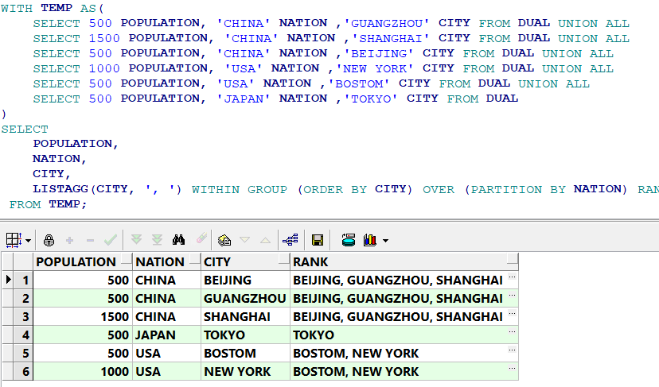

### Oracle列转行函数LISTAGG() WITHIN GROUP ()的使用方法
#### 基础用法
LISTAGG(XXX, XXX) WITHIN GROUP(ORDER BY XXX)，就像聚合函数一样，通过Group by语句，把每个Group的一个字段，拼接起来。
LISTAGG()其实可以把它当作SUM()函数来使用或者理解。

##### 示例代码：
```
WITH TEMP AS(
    SELECT 'CHINA' NATION ,'GUANGZHOU' CITY FROM DUAL UNION ALL  
    SELECT 'CHINA' NATION ,'SHANGHAI' CITY FROM DUAL UNION ALL  
    SELECT 'CHINA' NATION ,'BEIJING' CITY FROM DUAL UNION ALL  
    SELECT 'USA' NATION ,'NEW YORK' CITY FROM DUAL UNION ALL  
    SELECT 'USA' NATION ,'BOSTOM' CITY FROM DUAL UNION ALL  
    SELECT 'JAPAN' NATION ,'TOKYO' CITY FROM DUAL   
)  
SELECT
    NATION,
    LISTAGG(CITY, ', ') WITHIN GROUP (ORDER BY CITY) AS CITIES
FROM TEMP
GROUP BY NATION;
``` 
##### 结果


#### 高级用法
over(partition by XXX)。在不使用Group by语句时候，也可以使用LISTAGG函数。

##### 示例代码：
```
WITH TEMP AS(  
    SELECT 500 POPULATION, 'CHINA' NATION ,'GUANGZHOU' CITY FROM DUAL UNION ALL  
    SELECT 1500 POPULATION, 'CHINA' NATION ,'SHANGHAI' CITY FROM DUAL UNION ALL  
    SELECT 500 POPULATION, 'CHINA' NATION ,'BEIJING' CITY FROM DUAL UNION ALL  
    SELECT 1000 POPULATION, 'USA' NATION ,'NEW YORK' CITY FROM DUAL UNION ALL  
    SELECT 500 POPULATION, 'USA' NATION ,'BOSTOM' CITY FROM DUAL UNION ALL  
    SELECT 500 POPULATION, 'JAPAN' NATION ,'TOKYO' CITY FROM DUAL   
)  
SELECT 
    POPULATION,
    NATION,
    CITY,
    LISTAGG(CITY, ', ') WITHIN GROUP (ORDER BY CITY) OVER (PARTITION BY NATION) RANK
FROM TEMP;
```
##### 结果
