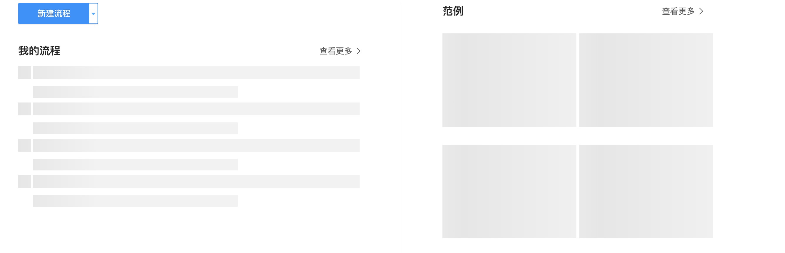
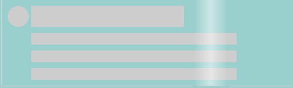
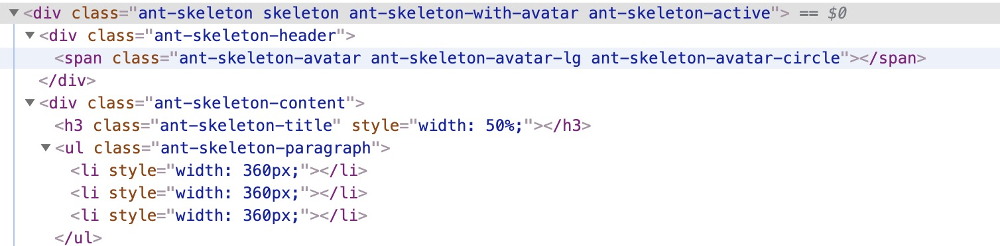

### Skeleton 的实现

众所周知前端是一个注重用户体验的职业，本文的探讨重点是一个提升用户体验的 **(骨架屏)Skeleton Screen** 的实现。




上面就是一个骨架屏，它的作用就是给用户一种页面提前渲染的错觉，所以骨架屏也就是空页面和真实页面之间的一种过度页面，我们把在首屏加载或是数据请求开始和返回的时间差内，在页面中显示出正常页面中的 **占位(placeholder)** 称之为 **骨架屏**。 

**那为什么我们需要使用骨架屏？**

随着网络和终端性能的提升，用户对于页面的体验有了更高的期望，他们甚至希望得到和请求本地数据相同的视觉体验，但是单单 SPA 的首屏加载慢，长时间的 loading 会让人很不爽。所以如果有个骨架屏的存在，会让糟糕的体验变得好多了，相对于白屏和 spinner 它更加容易被人接受。
[这里](https://uxdesign.cc/what-you-should-know-about-skeleton-screens-a820c45a571a) 阐述了一些为何使用骨架屏和一些骨架屏使用的调查结果。

***
 下面从以下三个方面去看下骨架屏的三种实现方式，[这里](https://codesandbox.io/s/tender-dan-4izgz?file=/src/containers/antd-skeleton/index.css:0-593)是三种实现方式的线上源码，有兴趣可以去看看。
 * <a href='#css'>Skeleton with CSS</a>
 * <a href='#html'>Skeleton with HTML</a>
 * <a href='#svg'>Skeleton with SVG</a>

以一个很常见的信息展示 Card 组件开始，我们去实现这个 Card 的骨架。如下图：

 

#### <a name='css'>Skeleton with CSS</a>

  首先是最为原始而且是最为繁琐的实现方式。
  使用 CSS 实现，我们需要用到 **[:empty](https://developer.mozilla.org/zh-CN/docs/Web/CSS/:empty)** 选择器。在页面初次加载时，没有数据,这时元素内容为空，**:empty** 就发挥作用了。
  然后我们用 CSS 绘制一个背景图片。如上图，页面中包含五个块， 头像、标题和三个描述信息。
  这里利用 元素接收多层 background 的特点，依次绘制这些块的内容。
  ``` css
  background-image:
    radial-gradient( circle 18px at 18px 18px, lightgray 99%, transparent 0 ), /* avatar */
    linear-gradient( 90deg, 
      rgba(255, 255, 255, 0), 
      rgba(255, 255, 255, 0.5) 50%, 
      rgba(255, 255, 255, 0) 100% ),  /* card */
    linear-gradient( lightgray 36px, transparent 0 ), /* title */
    linear-gradient( lightgray 20px, transparent 0 ), /* desc1 */
    linear-gradient( lightgray 20px, transparent 0 ), /* desc2 */
    linear-gradient( lightgray 20px, transparent 0 ); /* desc3 */
  ``` 
  然后，设置这些元素的尺寸。
  ``` css
  background-size:
    100px 200px, /* avatar */
  background-position:
    10px 10px, /* avatar */
    0 0,  /* card */
    50px 10px, /* title */
    50px 56px, /* desc1 */
    50px 86px, /* desc2 */
    50px 116px; /* desc3 */
  ```
  最后，加上一点小动画。
  ``` css
  animation: loading 1.4s  ease infinite;
  @keyframes loading {
  to {
    background-position:
      10px 10px, /* avatar */
      100% 0, /* card */
      50px 10px, /* title */
      50px 56px, /* desc1 */
      50px 86px, /* desc2 */
      50px 116px; /* desc3 */
    }
  }
  ```
  如此，一个简单的骨架屏就完成了。但是这个只是一个非常简单的内容，已经花费了大量的工作，更不要说复杂一点的内容展示了。更悲剧的是产品经理告诉你 Card 需要改造，这个时候就一脸懵逼了。
 > CSS 可以完成骨架屏的显示，但是整个开发过程相对来说比较繁琐，不利于维护。

#### <a name='html'>Skeleton with HTML</a> 

  这种方式一般都是使用真实的 dom 元素渲染在页面中，在确定页面的结构后，使用最精简的方式表现出页面结构，辅助 css 展现出骨架的样子。
  下面三种种方式都是以这种方式实现的。
  * [react-loading-skeleton](https://github.com/dvtng/react-loading-skeleton)
  * [antd skeleton](https://ant.design/components/skeleton-cn/)
  * [react-placeholder](https://github.com/buildo/react-placeholder)

  以 antd Skeleton 为例。
  ``` javascript
  <Skeleton
    className="skeleton"
    active
    avatar
    paragraph={{ rows: 3, width: ["360px", "360px", "360px"] }}
  />
  ```
  CSS 省略...
  以 antd Skeleton 为例， Skeleton 的工作是通过配置生成对应的 ul>li 的结构，配合 antd 的 css 文件，达到骨架的效果。但是这种在绝大部分时间中并不能满足业务场景，所以需要复写这些 li 的样式。下图为 Card 骨架在页面中的 dom 结构。

   

   虽然这些框架可以很方便的生成对应的骨架结构，并辅以 CSS 可以达到不错的效果。当时它的局限性在于对稍微复杂一点的结构很难有很好的诠释。如下图

   

   > 这种实现方式在应对简单的页面结构加上少量的 css 还是很方便的，但是复杂一点的布局还是需要另外一种更好的方式。

  #### <a name='svg'>Skeleton with SVG</a>

  * [react-content-loader](https://github.com/danilowoz/react-content-loader)
  * [vue-content-loader](https://github.com/egoist/vue-content-loader)

  这两个库是当前比较成熟的 SVG 实现方案，分别是基于 React 和 Vue 的实现。下面是两种 Card 的骨架实现：

  ``` javascript
    // 这是实现第一种 Card 的骨架
    import ContentLoader from "react-content-loader";
    <ContentLoader
      speed={1.4}
      width={"100%"}
      height={"100%"}
    >
      <circle cx="18" cy="18" r="18" stroke="lightgray" stroke-width="2" />
      <rect x="40" y="0" width="260" height="36" />
      <rect x="40" y="46" width="360" height="20" />
      <rect x="40" y="76" width="360" height="20" />
      <rect x="40" y="106" width="360" height="20" />
    </ContentLoader>
  ```

  实现一种非常规 dom 结构没有什么区别。
  ``` js
  // 这是实现第二种 Card 的骨架
  import ContentLoader from "react-content-loader";
  <ContentLoader
    speed={1.4}
    width={260}
    height={300}
    backgroundColor="#fff"
    foregroundColor="#e6e6e6"
  >
    <circle cx="38" cy="28" r="18" />
    <rect x="22" y="140" width="200" height="36" />
    <rect x="22" y="206" width="220" height="20" />
    <rect x="22" y="236" width="170" height="20" />
  </ContentLoader>
  ```
> 由以上可以看出，使用 SVG 实现骨架屏，使用少量的代码去 cover 住各种不同的场景，而且 SVG 绘制这种布局学习成本比较低，所以是个不错的选择。

**总结：** 虽然以上的三种方式都可以使用模仿真实 DOM 的结构而达到骨架屏的效果。在一个更新迭代快的项目中，尤其是对 UI 方面的变更，反复修改骨架对于开发人员来说是一份十分无趣的负担。所以是否有更好的解决方案？是否可以有个自动构建的骨架工具？持续学习中。。。

参考资料：
* [Everything you need to know about skeleton screens](https://uxdesign.cc/what-you-should-know-about-skeleton-screens-a820c45a571a)
* [Building Skeleton Screens with CSS Custom Properties](https://css-tricks.com/building-skeleton-screens-css-custom-properties/)
* [一种自动化生成骨架屏的方案](https://github.com/Jocs/jocs.github.io/issues/22)
